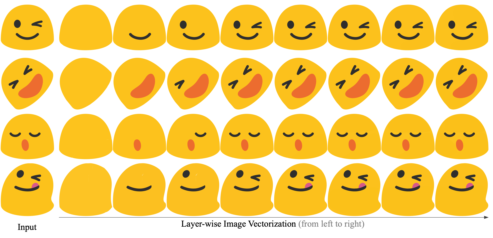

# LIVE-pytorch
Towards Layer-wise Image Vectorization

### Updated： 
we added  detailed [conda env file](env.yml) and collected detail [system information](system_info.txt) to help the installation.

A more detailed docker and Google Colab demo will be provided.


<div align="center">
  
</div>
LIVE is able to explicitly presents a Layer-wise representation for simple images. 

## Installation
```bash
pip3 install torch torchvision
pip install svgwrite
pip install svgpathtools
pip install cssutils
pip install numba
pip install torch-tools
pip install visdom
pip install scikit-fmm
```
Next, please refer DiffVG to install [pydiffvg](https://github.com/BachiLi/diffvg)


## Run
```bash
python main.py --config config/all.yaml --experiment experiment_8x1 --signature demo1 --target data/demo1.png
```
Please modify the config files to change configurations.
